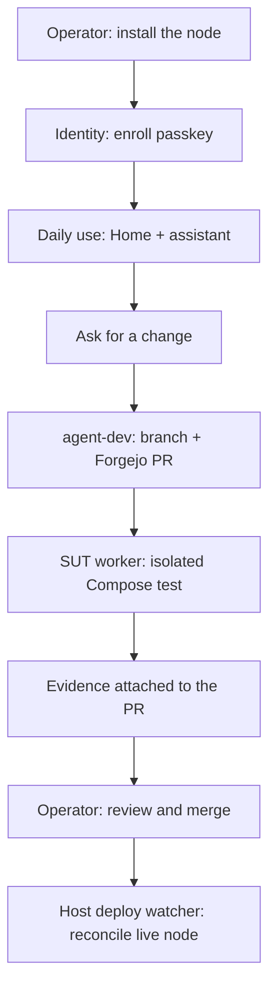

# Onboarding a trusted user — and your development cloud

Geth is both a personal cloud for daily life and a development cloud that can
adapt that life to you. A trusted user needs only a passkey and the homepage;
the operator additionally turns on the development plane so requests can move
from conversation to a reviewed, tested change without granting an agent the
keys to the running node.

The reviewer agent will eventually sit between SUT evidence and the operator's
decision. It is intentionally not part of the first development-plane setup:
the deterministic SUT gate must earn trust before a model is asked to interpret
its result.

## Operator journey — eventual flow

### 1. Bring up the sovereign node

Install Docker Compose, clone this repository, set the node-local values in
`.env`, then run `./scripts/up.sh`. It scaffolds local-only secret files,
validates the config, brings up the core plane, bootstraps Forgejo, and sets up
identity and the host deployment watcher. The first operator action in the
browser is to enroll a primary passkey at `auth.<domain>/setup`; enroll a
second passkey before relying on the node.

### 2. Enable the development plane

The development plane is a core Geth capability, but its isolated test worker
is provisioned lazily: it consumes disk and virtual-machine resources only on
machines that will develop the node. `./scripts/bootstrap-forgejo.sh` mints a
separate `SUT_FORGEJO_TOKEN` with only source/PR-read and PR-comment scopes.
Then run `host/sut/sutctl.sh doctor`, `host/sut/sutctl.sh init`, and
`host/sut/install-launchd.sh`.

On macOS this creates a stopped, dedicated Colima profile such as
`geth-sut-01`; on Linux the same interface will target a dedicated KVM worker.
The production Docker context is never changed. The worker starts only when a
candidate change needs a full-stack test and is bounded by the resource budget
chosen during initialization.

### 3. Ask for software, not a vendor feature

Use the assistant or assign a tracked task to `agent-dev`. The agent can
inspect code, make a branch, and open a Forgejo PR. It cannot merge, deploy,
read node secrets, or use Docker. A request that needs a new external
capability still goes through the relevant allowlist and approval path.

### 4. Let the deterministic gate examine the candidate

A host-side SUT watcher polls Forgejo for a new or changed `agent-dev` PR. It
is deliberately a poller rather than a Forgejo Actions workflow: an agent can
push workflow YAML in its PR, but it must not be able to turn that YAML into
host execution. The watcher checks out the candidate, sends a secret-free copy
to the isolated worker, runs Compose configuration checks and the representative
stack, and posts a concise pass/fail record keyed to the PR head commit.

The SUT worker gets synthetic secrets only. It has no production Docker socket,
no host source mount, no `.env`, and no ability to deploy. A failed test holds
the PR; a new commit creates a fresh test attempt. The operator can inspect the
attached logs and tear down the worker if needed.

### 5. Decide, merge, and recover

The operator remains the approval point. After the SUT result is green (and,
in the next milestone, a reviewer has summarized it), the operator reviews and
merges in Forgejo. The existing deploy watcher then fast-forwards the clean
host checkout and executes the normal deterministic deploy. Reverting the
merge and redeploying is the rollback path.

## What each person needs to learn

| Person | First action | What they can do | What they cannot do |
|---|---|---|---|
| Trusted user | Open invite, create passkey | Use Home and their apps | Alter node configuration |
| Operator | Enroll backup passkey, enable SUT | Approve, merge, recover, manage capacity | Delegate the merge decision to an agent |
| Assistant | Receive a request | Explain, create handoffs | Write code or deploy |
| `agent-dev` | Receive an operator-approved task | Branch, edit, push, open a PR | Access secrets, Docker, merge, deploy |
| SUT worker | Receive a candidate SHA | Build and test a disposable stack | Reach production state or approve changes |

## Capacity and lifecycle

Start with one worker (`geth-sut-01`) and a one-job queue. A second worker is
an operator capacity decision, not an agent decision: each worker is an
independent VM with its own Docker engine, images, networks, and volumes. A
candidate can control Compose and therefore may compromise its own worker; the
controller preserves evidence on the host but destroys the complete worker VM,
containers, volumes, generated secrets, and checkout after every result.

## TL;DR — the checklist

Operator, once per user:

1. `./scripts/invite.sh <username> <email> "Display Name"` — prints a
   single-use, 72-hour link and (with `qrencode` installed) a scannable QR.
2. Send the link / show the QR.

The new user, on the phone they always carry:

1. Open the link.
2. Tap **Create passkey** → approve with Face ID / fingerprint. There is no
   password step — Pocket ID doesn't have one.
3. Open `https://home.<domain>`, add it to the home screen. Every app is a
   tile there; tapping a tile signs them in with the same passkey.

That's the entire flow. Passkey-only is enforced by the product: there is no
password mode to fall back to, nothing to configure wrong.

## One-time operator setup (Ring 0)

1. **Initialize Pocket ID.** Visit `https://auth.<domain>/setup` and enroll
   YOUR passkey — the first account is the admin. This is the Ring 0
   identity; enroll a second passkey (backup device or hardware key) from
   the admin UI before inviting anyone.
2. **Mint an API key** (admin → API Keys) and put it in `.env` as
   `POCKET_ID_API_KEY` — `scripts/invite.sh` uses it. (`.env` is the node
   plane only; each app's secrets live in host-only `secrets/<app>.env`,
   scaffolded by `scripts/install.sh` — see `docs/SSO.md`.)
3. **Federate the apps:** `./scripts/sso-setup.sh` — mints OIDC clients in
   Pocket ID for every human surface (Forgejo, LiteLLM UI, Miniflux, Open
   WebUI, Memos, and the oauth2-proxy shim), registers the auth source in
   Forgejo, seeds the Memos identity provider (set `MEMOS_ADMIN_TOKEN` in
   `.env` first, or paste the printed values once), grants your Pocket ID
   identity LiteLLM UI admin, and starts the authshim. Local admin password
   logins stay enabled as the documented break-glass. Re-run the script
   whenever a new surface lands — it is idempotent.
4. **Non-OIDC apps** (Radicale): already at the door — the authshim gates the
   web UI at `cal.<domain>`; DAV paths stay on the ring guard because CalDAV
   clients speak Basic auth, not OIDC redirects. To shim another app: add its
   callback URL to the `oauth2-proxy` client in Pocket ID and put its Caddy
   route behind `import authed` (plus a `/oauth2/*` proxy — see `cal`'s route).

## Reality check for the current MVP

Until the anchor lands (M2), this box sits behind CGNAT and **is not
reachable from the internet**. Today that means:

- Trusted users must be on the same LAN (and note: if your LAN hands out
  non-RFC1918 addresses, Caddy's `private_ranges` ring guard will reject
  them — adjust the guard or wait for identity-aware auth to replace it).
- For local development with `NODE_DOMAIN=localhost`, add hosts entries
  (`127.0.0.1 auth.localhost home.localhost git.localhost llm.localhost
  cal.localhost`) or use `curl --resolve`; Caddy serves these names from its
  internal CA, so trust that CA once
  (`docker exec caddy cat /data/caddy/pki/authorities/local/root.crt`).

The permanent fix is the M2 front door: a disposable VPS running an L4 SNI
passthrough, WireGuard dialed outbound from the node, TLS terminating here.
The steps above are written against that end state and work unchanged once
the anchor exists.
